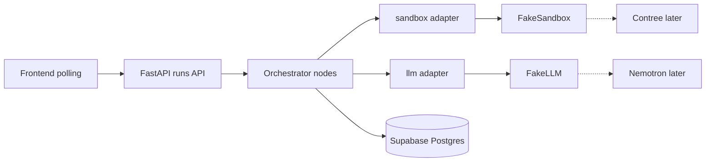

# Build now: mock-first Phase 1 (Nebius in 3–4 days)

## What is actually blocked

[docs/06-Step-by-Step-Build-Guide.md](docs/06-Step-by-Step-Build-Guide.md) Phase 0 exit criteria need a live Contree sandbox and Nemotron keys:

- spawn / checkpoint / fork / run / rollback smoke test
- determinism/caching check (this **gates Phase 2** Idea 1 — flaky-test forensics)
- real SWE-bench reproduce + golden integration run

Until then, **do not** write orchestration that assumes repeated identical sandbox runs behave a certain way. **Do** build everything that talks to Contree/Nemotron through one wrapper so the swap is a single module.

Hackathon rule still holds later: the **working demo must use real Token Factory + Nemotron**. Mocks are for the wait, not the submission.

## Current repo vs the docs

- Docs skeleton lives under `backend/` + `frontend/`. Today you have a default Vite app in [Frontend/](Frontend/) (React 19, no Tailwind, no react-flow, no API client) and **no backend**.
- [AGENTS.md](AGENTS.md) already overrides [docs/00-Decisions-Log.md](docs/00-Decisions-Log.md): **Supabase hosted Postgres, not local Docker Postgres.** Skip `docker-compose` Postgres for now. Redis/Celery can wait; [docs/04-Tech-Stack.md](docs/04-Tech-Stack.md) already prefers `asyncio.gather` at hackathon scale.
- Keep folder names as they exist (`Frontend/`, add `Backend/`) unless you explicitly want a rename later.

## What to build in the wait (Phase 1 MVP, mock-backed)

This is the Phase 1 loop from the build guide, runnable without Nebius: **POST a run → tree of 3 search branches → winner or honest failure**, via API.

**1. Repo skeleton + env (half day)**

- `Backend/app/` with `api/`, `orchestrator/`, `models/`, `sandbox/`, `llm/`, `db/`
- `.env.example` with placeholder names: `NEBIUS_API_KEY`, `CONTREE_PROJECT_ID`, `SUPABASE_URL`, `SUPABASE_SERVICE_ROLE_KEY`, `LLM_PROVIDER=fake|nebius`, `SANDBOX_PROVIDER=fake|contree`
- `Backend/requirements.txt` after checking current package versions (FastAPI, uvicorn, pydantic, supabase, pytest, httpx) — no Contree pin until you can install/smoke it

**2. Data model + Supabase tables (half day)**

Match [docs/03-Technical-Architecture.md](docs/03-Technical-Architecture.md): `runs` and `nodes` (parent/child tree, branch_type, status, patch_diff, test_result, model_used, cost/time fields). Apply via existing Supabase project. Truncate large logs in-row for now (object storage later).

**3. Isolation adapters (the whole point of waiting well)**

- `sandbox/`: Protocol with `spawn`, `checkpoint`, `fork`, `run_command`, `rollback`. **`FakeSandbox`**: in-process dict of “filesystems”, canned fail-then-pass tests, fork copies state. No real Docker required.
- `llm/`: Protocol with `generate_patch`, `replan`, `write_adversarial_test`, `write_report`. **`FakeLLM`**: return three distinct canned diffs (the three instructions from [docs/00-Decisions-Log.md](docs/00-Decisions-Log.md): minimal / alternative / elsewhere) plus a canned Ultra replan.

**4. Orchestrator + API (the real Phase 1 work)**

Nodes as functions/classes, LangGraph only if it stays simple — custom asyncio state machine is an explicit fallback:

- `ReproduceNode` → `SearchNode` (fan-out 3) → `EvaluateSearchNode`
- `ReplanNode` capped at 2 rounds → `ReportFailureNode` if exhausted
- Hard limits: max rounds, per-branch timeout, max spend (record zeros from fake LLM)

API from Phase 1 (polling, no WebSocket yet):

- `POST /runs`, `GET /runs/{id}`, `GET /runs/{id}/tree`, plus `GET /health`

**5. Unit tests that do not need Nebius** (called out in the Testing Strategy)

- Given 3 branch results → winner vs replan vs failure
- Reward-hacking rule: reject patches that touch the test file
- Max-rounds cap
- One fixture “golden” JSON tree for the frontend

**Exit for the wait:** `uvicorn` up, `POST /runs` returns a completed tree from FakeSandbox + FakeLLM, stored in Supabase, readable via `GET /runs/{id}/tree`.

## What else you can start (Phase 2–4) without Nebius

| Work | Do now? | Why |
|---|---|---|
| Phase 2 `StabilityNode` **logic** + schema fields + fake k=5 forks | Yes, as **stub + tests** | Routing/UI/API can land; **do not claim Idea 1 works** until the real Contree cache test |
| Phase 3 adversarial / full-suite / report **schemas, fake nodes, report template** | Yes, thin stubs | Same: wiring only |
| Phase 4 tree UI against fixture + live polling | **Yes — high leverage** | Design is a judging criterion; docs say frontend QA against a pre-recorded run is enough |
| Real Contree smoke + Nemotron curl | No | Needs keys |
| Determinism experiment | No | Gates real Phase 2 |
| Pre-run 3–5 SWE issues | No | Needs sandboxes |
| Demo video / “how we used Nemotron” copy | Outline only | Must show real Token Factory later |

**Frontend in the wait (use existing [Frontend/](Frontend/)):** Tailwind + react-flow + React Query; screens: submit run, tree (search / stability / adversarial visual zones), node detail (diff, test output, model badge), cost/latency header, honest-failure report. Point at local FastAPI with polling. Optional: hardcoded fixture so UI works even if backend is mid-build.

Skip WebSocket until the mock loop is solid (Phase 4 in the official order).

## Suggested 3–4 day sequence

- **Day 1:** Backend skeleton, Pydantic models, Supabase `runs`/`nodes`, FakeSandbox + FakeLLM, health endpoint
- **Day 2:** Phase 1 orchestrator (reproduce → 3-way search → join → replan ×2 → report), unit tests, `POST/GET /runs` + tree
- **Day 3:** Frontend tree + polling against a real mock run; cost header; failure path visible
- **Day 4:** Stability/adversarial **stubs** in schema + UI zones fed by fake nodes; `.env.example`; short README “run locally with fakes”

When Nebius lands (1–2 days, not a rewrite):

1. Install Contree SDK, pin version, run Phase 0 script **before** changing orchestrator
2. Validate caching; only then implement real StabilityNode variation
3. Implement `ContreeSandbox` + `NebiusLLM` behind the same protocols; default env to live
4. One cheap preloaded SWE issue as the golden integration test (manual, not CI)

## Do not spend the wait on

- Docker Compose Postgres (Supabase is the project decision)
- Celery/Redis
- Overnight Serverless Jobs, PR creation, batch mode
- Next.js, vector DB, or hosting (Render/Railway comes after a live loop)

## Parallel non-code (still useful)

Request Token Factory + Contree beta as soon as a card works; join Builder Program if credits are needed; keep Devpost track as Coding and Agentic Engineering. Differentiation pitch stays: **search-and-verify, not just search**.
