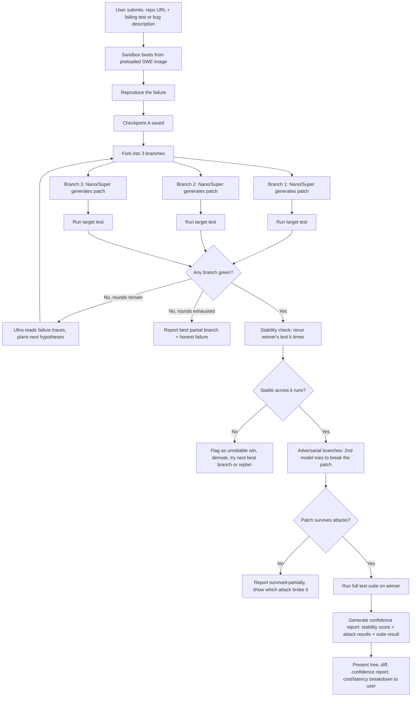

# 02 — Product Features and User Flow

## Feature List

### Must-Have (MVP for submission)
| # | Feature | Why It's Must-Have |
|---|---|---|
| 1 | Submit a repo + failing test / bug description | Core input; without it there's no product |
| 2 | Reproduce failure in a Contree sandbox → Checkpoint A | Foundation of the whole search tree |
| 3 | Fork into N patch-hypothesis branches | The core "branching" mechanic |
| 4 | Nemotron Nano/Super generate a patch per branch | Core generation step |
| 5 | Run the target test on every branch, in parallel | Core verification step |
| 6 | **Stability check**: re-run the winning branch's test k times before declaring victory | Idea 1 — flaky-test forensics; this is a headline differentiator |
| 7 | Ultra-driven replanning when all branches fail (max 2 rounds) | Prevents dead ends; bounded cost |
| 8 | Live tree UI showing branches, pass/fail, and status | "Design" judging criterion — must look like a product |
| 9 | Cost + latency counter shown per run and per branch | Transparency is part of the pitch |
| 10 | Hard limits: max rounds, per-branch timeout, max total spend | Prevents runaway cost/latency during the live demo |
| 11 | Final human-readable summary ("what changed, why, confidence") | Judges and users need a plain-language answer, not just a diff |

### Should-Have (strong differentiator, build if time allows)
| # | Feature | Why It Matters |
|---|---|---|
| 12 | **Adversarial verification**: fork the winning checkpoint, have a second model try to write a test that breaks the patch | Idea 2 — this is the second headline differentiator |
| 13 | Full-suite run on the winning branch (not just the named test) | Catches "passed this test, broke three others" |
| 14 | Confidence score (e.g. 0–100) combining stability + adversarial results | Turns two verification signals into one decision-ready number |
| 15 | Replayable run links (share a run's tree with a teammate) | Nice for demo credibility, low cost to add given Contree's deterministic replay |

### Nice-to-Have (cut first if behind schedule)
| # | Feature |
|---|---|
| 16 | Overnight Nebius Serverless Job that re-runs the full suite and emails/reports results |
| 17 | Multi-repo batch mode |
| 18 | PR auto-creation on the winning branch |
| 19 | Historical dashboard across multiple runs (cost trends, pass rates) |

## Complete User Flow

### Flow in Plain Terms
1. **Input.** User gives a public repo and a failing test (or description of the bug).
2. **Reproduce.** The sandbox confirms the bug is real and reproducible; this state is saved as Checkpoint A.
3. **Branch and attempt.** Three copies of Checkpoint A are made. Each gets an independently generated fix.
4. **Test in parallel.** The same test runs in all three copies at once.
5. **Decide.** If nothing passes, the biggest model (Ultra) looks at *why* all three failed and plans a smarter next round (capped at 2 rounds total).
6. **Don't trust the first green.** Once something passes, it is re-run several more times to rule out a flaky test.
7. **Try to break it.** A second model deliberately tries to find a case where the "working" fix actually fails.
8. **Full-suite check.** The winning fix is run against the entire test suite, not just the one target test.
9. **Report.** The user gets the code diff plus a plain-language confidence report: how stable it was, what attacks it survived, and what the whole process cost in time and money.

## The Tree UI

The tree UI is the single most important visual asset for the demo (3-minute video, judges scanning quickly). Requirements:

- **Nodes** = sandbox states (checkpoints). Each node shows: a short label (e.g. "Patch #2"), a status color (gray = running, green = passed, red = failed, yellow = flaky/unstable), and on hover: the diff, test output, model used, cost, and time taken.
- **Edges** = forks. A branch drawn from Checkpoint A to three children makes the "parallel attempt" idea visually obvious in under 2 seconds.
- **Distinct visual zones** for the three kinds of forking, so it doesn't look like "just another search tree":
  - **Search zone** — the original patch-hypothesis branches.
  - **Stability zone** — small cluster of repeated runs on the winner, visually distinct (e.g. dashed border) to signal "we're double-checking."
  - **Adversarial zone** — a different color (e.g. red-outlined) showing attack attempts against the winner.
- **Timeline scrub bar** (optional, nice-to-have) to replay the whole run.

## What Happens When All Branches Fail

This must be handled honestly, not hidden:
- After the configured max rounds (recommend 2), the system stops automatically — no infinite retries.
- The UI shows the **least-bad branch** — e.g., the one that fixed the most sub-assertions or got closest to passing — rather than a blank failure screen.
- The final report explicitly states: "No fix passed verification. Best attempt: [branch], which achieved [partial result]. Recommended next step: [manual review / narrower bug report / longer budget]."
- This honesty is itself a feature to highlight in the pitch — most agent demos hide failure; BVA treats "we tried, verified, and it's not there yet" as a legitimate, trustworthy outcome.

## Cost and Latency Transparency Features
- Every branch shows: wall-clock time, tokens used, which Nemotron tier was called, and (once Nebius Sandboxes pricing is out of beta) CPU-time. During beta, since sandbox execution is free, show CPU-seconds and wall time rather than a dollar figure that doesn't reflect a real cost.
- A running total at the top of the UI: "Round 1: $0.02 / 47s. Round 2: $0.04 / 93s. Stability checks: $0.01 / 22s. Adversarial checks: $0.03 / 31s."
- Hard caps configurable per run (see Risks doc): max total spend, max wall-clock time, max rounds.

## Overnight Full-Suite Verification Job
- Optional Nebius Serverless Job, scheduled after a run completes, that re-runs the entire repository test suite (not just the target test) against the winning branch's final state.
- Reports back: pass/fail across the full suite, any new regressions found, total job cost.
- Positioned as the "sleep on it" step — a cheap, async confidence boost that doesn't block the live demo, but is worth mentioning as a maturity signal ("this isn't just optimized for a 3-minute demo — it's designed for real CI use").
