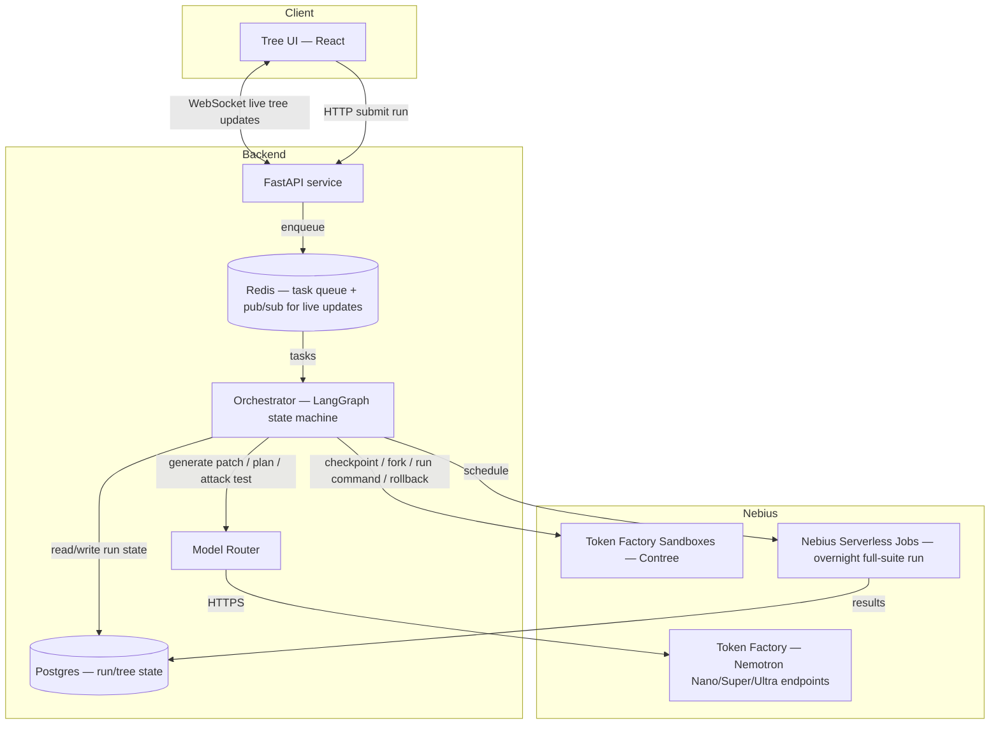

# 03 — Technical Architecture

## High-Level System Architecture



## The Search Tree / Branching Mechanism, In Detail

The tree has **three distinct kinds of branching**, which is the core architectural difference from a plain search agent. Each kind has its own trigger, its own branching factor, and its own success condition.

### 1. Search Branching (find *a* fix)
- **Trigger:** a bug has been reproduced (Checkpoint A exists).
- **Branching factor:** 3 (configurable) parallel hypotheses per round.
- **Each branch:** fork of the parent checkpoint → patch applied → target test run.
- **Success condition:** at least one branch's target test passes.
- **Bound:** max 2 rounds. If round 1 fails entirely, Ultra reads all 3 failure traces and proposes up to 3 new hypotheses for round 2, either from Checkpoint A or from the least-bad round-1 branch.

### 2. Stability Branching (prove the fix *isn't lucky*)
- **Trigger:** a search branch's target test passes.
- **Branching factor:** k (recommend k=5) forks of the *winning* checkpoint.
- **Each branch:** re-run the exact same test command, nothing else changes.
- **Success condition:** all k runs pass. (If Contree's determinism cache would short-circuit truly identical runs, force distinct runs — e.g. vary process/thread scheduling or disable caching for this stage — see Tech Stack doc note on determinism.)
- **Outcome if unstable:** the branch is downgraded from "winner" to "flaky-unreliable," and either the next best search branch is promoted and stability-checked, or — if no other candidate exists — the system reports "no verified fix" rather than a false positive.

### 3. Adversarial Branching (prove the fix *isn't narrow*)
- **Trigger:** a branch survives stability checking.
- **Branching factor:** m (recommend m=2–3) forks of the stable winning checkpoint.
- **Each branch:** a second model (Super or Ultra) is prompted to write a new test case designed to break the patch, based on the bug's context, then runs it.
- **Success condition:** the patch survives all attack attempts, or — more realistically for a demo — the report is honest about which attacks it survived and which (if any) it did not.
- **Final step regardless of outcome:** run the *full existing test suite* against the winning checkpoint to catch regressions the target test never covered.

### ASCII View of a Full Run
```
Checkpoint A (bug reproduced)
├── Search Branch 1 (fail)
├── Search Branch 2 (PASS) ──► Stability Fork 1 (pass)
│                              ├── Stability Fork 2 (pass)
│                              ├── Stability Fork 3 (pass)
│                              ├── Stability Fork 4 (pass)
│                              └── Stability Fork 5 (pass)   [STABLE]
│                                     │
│                                     ├── Adversarial Fork 1 (patch survives)
│                                     └── Adversarial Fork 2 (patch survives)
│                                            │
│                                            └── Full Suite Run (PASS)
│                                                   │
│                                                   └── CONFIDENCE REPORT
└── Search Branch 3 (fail)
```

## How Contree (Nebius Sandboxes) Is Used

| Contree Primitive | Used For |
|---|---|
| **Spawn from preloaded SWE image** | Starting point for each run — use the preloaded SWE-bench-style environments rather than arbitrary repos, for demo reliability |
| **Checkpoint** | Saved after: (a) bug reproduction, (b) each successful patch application, (c) each stability/adversarial fork point |
| **Fork** | Creates N independent copies from one checkpoint for search, stability, or adversarial branches |
| **Run command** | Applies patches, runs tests, runs attack scripts — same interface for all three branch types |
| **Rollback** | Used when a round fails entirely and the orchestrator needs to retry from Checkpoint A or a specific earlier branch |
| **Deterministic replay** (same command + same state → same result, cached) | Exploit for the "replay a run" nice-to-have feature; be aware this can interfere with true stability testing — see note below |

**Important implementation note on determinism:** if Contree caches results for identical (state, command) pairs, a naive "run the same test 5 times" stability check may just return the same cached result 5 times, defeating the entire point of Idea 1. Before building the stability-check feature, verify experimentally whether repeated identical runs actually re-execute or hit a cache. If cached, the stability check must either (a) disable caching for this specific call type, or (b) introduce a controlled variation (e.g., a random seed or the `-p no:cacheprovider`/`--forked` style test-runner flag) so each stability run is a genuine re-execution. **Do not skip this validation — it is a real risk to the headline feature, not a nice-to-have detail.**

## Model Routing Strategy

| Step | Model | Reasoning |
|---|---|---|
| Initial patch hypothesis generation (round 1) | Nemotron Nano or Super | Cheap, fast, "first guess" quality is enough when trying 3 in parallel |
| Meta-planning after all branches fail | Nemotron Ultra | Requires reading multiple failure traces and reasoning about *why* — the one place raw reasoning power matters |
| Stability-check orchestration | No model call needed (deterministic re-execution) — Nano only if a failure needs classifying (same failure vs. new failure) | Keep this stage cheap; it's pure execution, not generation |
| Adversarial test generation | Nemotron Super (escalate to Ultra if Super's attacks are trivially weak) | Needs enough reasoning to write a meaningfully adversarial test, but not full Ultra-tier cost for every attack |
| Final confidence report generation | Nemotron Ultra (or Super) | Needs to synthesize multiple signals (stability, attack results, suite results, cost/time) into a clear plain-language summary |

## State Management

Recommend a **LangGraph state machine** (or an equivalent custom state machine if LangGraph's Contree/Sandbox integration is immature — validate this early per the Build Guide) with these node types:

- `ReproduceNode` → `SearchNode` (fan-out to N branches) → `EvaluateSearchNode` (join)
- `EvaluateSearchNode` routes to: `StabilityNode` (if a branch passed) OR `ReplanNode` (Ultra, if all failed and rounds remain) OR `ReportFailureNode` (if rounds exhausted)
- `StabilityNode` (fan-out to k branches) → `EvaluateStabilityNode` (join) → routes to `AdversarialNode` or back to `EvaluateSearchNode` (demote and try next candidate)
- `AdversarialNode` (fan-out to m branches) → `EvaluateAdversarialNode` (join) → `FullSuiteNode` → `ReportNode`

Each fan-out/join pair maps directly onto a set of Contree forks executed concurrently and awaited together.

## Data Model — What We Store Per Tree Node

```json
{
  "node_id": "uuid",
  "run_id": "uuid",
  "parent_node_id": "uuid | null",
  "branch_type": "search | stability | adversarial | root",
  "checkpoint_id": "contree-checkpoint-id",
  "hypothesis": "text description of the approach, if applicable",
  "patch_diff": "unified diff text, if applicable",
  "test_command": "string",
  "test_result": "pass | fail | error | timeout",
  "test_output": "truncated stdout/stderr",
  "model_used": "nano | super | ultra | none",
  "tokens_in": 0,
  "tokens_out": 0,
  "wall_time_seconds": 0.0,
  "sandbox_cpu_seconds": 0.0,
  "estimated_cost_usd": 0.0,
  "created_at": "iso8601",
  "status": "running | complete | failed"
}
```

A `run` record aggregates: `run_id`, `repo_url`, `bug_description`, `target_test`, `status`, `winner_node_id`, `confidence_score`, `total_cost_usd`, `total_wall_time_seconds`, `created_at`, `completed_at`.

## API Design (Main Endpoints)

| Endpoint | Method | Purpose |
|---|---|---|
| `/runs` | POST | Submit a new run: repo URL, failing test / bug description, config overrides (max rounds, k, m, spend cap) |
| `/runs/{run_id}` | GET | Get run summary: status, winner, confidence score, cost/time totals |
| `/runs/{run_id}/tree` | GET | Get the full tree of nodes for rendering the UI |
| `/runs/{run_id}/ws` | WebSocket | Live stream of node status changes as the run progresses |
| `/runs/{run_id}/report` | GET | Get the final plain-language confidence report |
| `/runs/{run_id}/replay` | GET | Re-fetch a completed run's tree for sharing (uses stored data, not a live re-execution) |
| `/health` | GET | Liveness check |

## Frontend Architecture

- **React + TypeScript** single-page app.
- **Tree component**: a directed-graph visualization (recommend `react-flow` for speed of implementation) that subscribes to the run's WebSocket and updates node colors/status live.
- **Detail panel**: clicking a node shows its diff, test output, model used, and cost — keeps the main tree visually uncluttered.
- **Cost/latency header bar**: always-visible running totals, updated live.
- **Report view**: a dedicated screen for the final confidence report, written in plain language, with the diff and a "Merge with confidence: High/Medium/Low" style summary badge.
- **State**: React Query (or SWR) for run summary polling as a WebSocket fallback; WebSocket as primary live-update channel.
